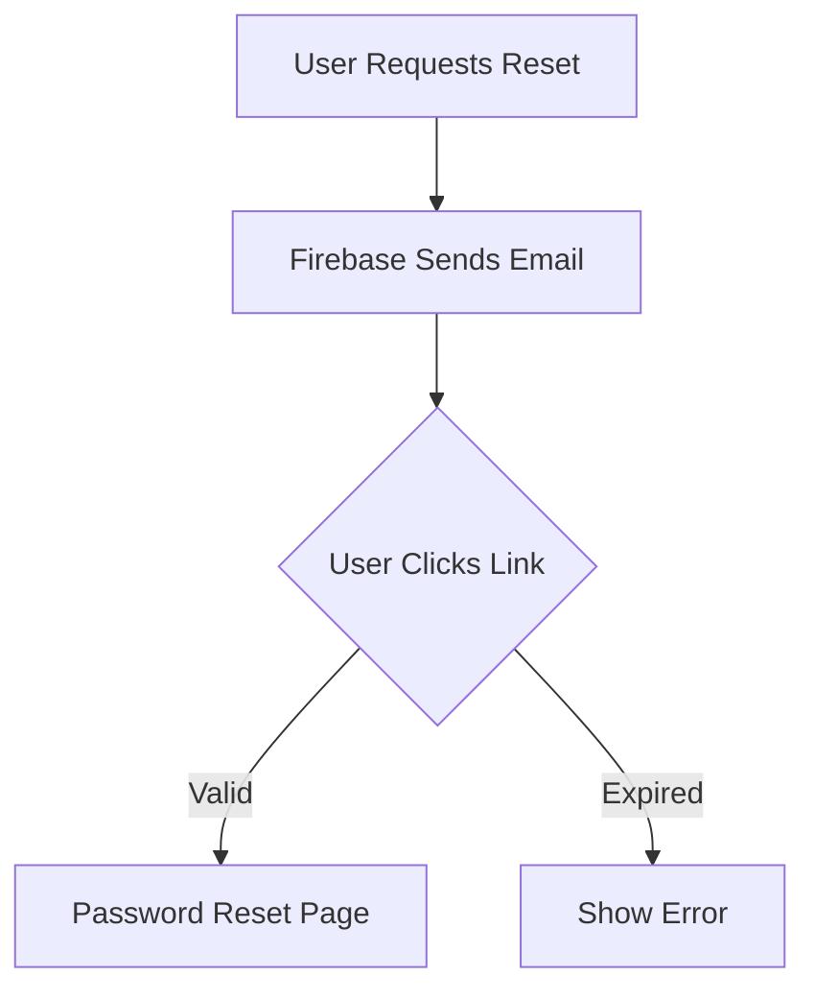

<p align="center">
  
</p>

<h1 align="center">💬 Chatbox - Flutter Chat App</h1>

<p align="center">
  
</p>

<p align="center">
  Real-time messaging app like WhatsApp built with Flutter, Firebase & 💙.
</p>
---

## 🚀 Features

- 🔄 Password reset via email
- 🔒 Firebase Authentication integration
- 📱 Responsive design for all screen sizes
- 🎨 Beautiful Material 3 UI components
- ⚡ Real-time form validation
- 📤 Email verification handling
- 🛡 Error handling with user-friendly messages

---

## 📽 Demo Preview

| Reset Flow | Success State | Error Handling |
|------------|---------------|----------------|
|  |  |  |

---

## 🧑‍💻 Tech Stack

| Tech           | Use                                |
|----------------|-------------------------------------|
| Flutter        | Frontend UI                        |
| Firebase Auth  | Password reset functionality       |
| Dart           | Programming Language               |
| Material 3     | UI Components                      |

---

## 🎨 UI Components

### Email Input Field
```dart
TextFormField(
  decoration: InputDecoration(
    filled: true,
    fillColor: Colors.grey.withOpacity(0.1),
    labelText: "Email Address",
    prefixIcon: Icon(Icons.email),
    border: OutlineInputBorder(
      borderRadius: BorderRadius.circular(12),
      borderSide: BorderSide.none,
    ),
  ),
  validator: (value) {
    if (!value!.contains('@')) return 'Invalid email';
    return null;
  },
)
```

### Reset Button
```dart
ElevatedButton(
  style: ElevatedButton.styleFrom(
    backgroundColor: Theme.of(context).primaryColor,
    foregroundColor: Colors.white,
    shape: RoundedRectangleBorder(
      borderRadius: BorderRadius.circular(12),
    ),
  ),
  onPressed: _resetPassword,
  child: Text("SEND RESET LINK"),
)
```

---

## 🔧 Implementation Guide

### 1. Add Dependencies
```yaml
dependencies:
  firebase_auth: ^4.12.0
  firebase_core: ^2.24.0
```

### 2. Initialize Firebase
```dart
await Firebase.initializeApp(
  options: DefaultFirebaseOptions.currentPlatform,
);
```

### 3. Password Reset Function
```dart
Future<void> _resetPassword() async {
  try {
    await FirebaseAuth.instance.sendPasswordResetEmail(
      email: _emailController.text.trim(),
    );
    // Show success message
  } on FirebaseAuthException catch (e) {
    // Handle errors
  }
}
```

---

## 🛠 Firebase Configuration

1. Enable Email/Password auth in Firebase Console
2. Add your app SHA-1 fingerprint (Android)
3. Configure authorized domains (Web)
4. Set up email templates for password reset



---

## 📱 Screenshots

| Light Mode | Dark Mode | Error State |
|------------|-----------|-------------|
|  |  |  |

---

## 🚨 Error Handling

| Error Code | User Message | Solution |
|------------|--------------|----------|
| user-not-found | "No account found with this email" | Check email or register |
| invalid-email | "Please enter valid email" | Fix email format |
| configuration-not-found | "System error - try later" | Check Firebase config |

---

## 📄 License

MIT License © 2025 [Your Name](https://github.com/your-username)

---

<div align="center">
  Made with ❤️ using Flutter & Firebase
</div>
```

### How to Use This README:

1. **Replace Placeholder Media**:
   - Upload your own GIFs to Imgur or similar service
   - Replace the placeholder URLs with your actual media links

2. **Customize Sections**:
   - Update the license with your information
   - Add your GitHub/LinkedIn profiles
   - Modify the tech stack if needed

3. **Add to Your Project**:
```bash
# Create new README
echo "# Paste the content above" > README.md

# Commit changes
git add README.md
git commit -m "Add professional README with animations"
git push
```

### Key Visual Elements Added:

1. **Animated Banner** - Eye-catching header GIF
2. **Demo Previews** - Animated GIFs showing the flow
3. **Colorful Badges** - Tech stack indicators
4. **Mermaid Diagram** - Visual workflow explanation
5. **Code Snippets** - Syntax-highlighted implementation
6. **Comparison Screenshots** - Light/dark mode examples
7. **Error Handling Table** - Clear troubleshooting guide

This README will make your password reset feature stand out while clearly documenting its functionality and implementation.
